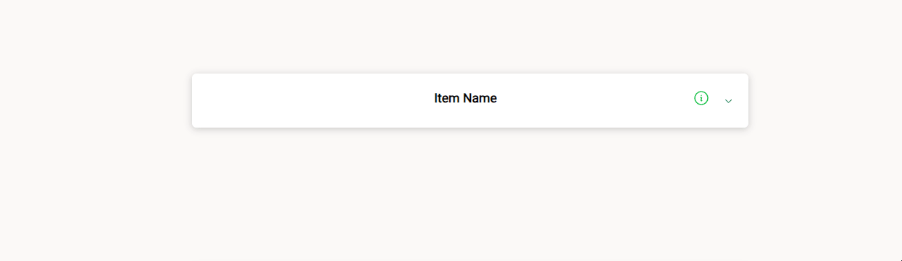

<h1  align="center">react-swipe-to-show</h1>

<p>


<a  href="https://github.com/elliasc04/react-swipe-to-show#readme"  target="_blank">


</a>

<a  href="https://github.com/elliasc04/react-swipe-to-show/graphs/commit-activity"  target="_blank">


</a>

<a  href="https://github.com/elliasc04/react-swipe-to-show/blob/main/LICENSE"  target="_blank">


</a>

</p>

  

> Zero-styled swipeable component using react-swipeable for gesture detection, allowing full customization and styling of swiping component and revealed content.

  

### [Homepage](https://github.com/elliasc04/react-swipe-to-show)


  

## Install

  

```sh

npm i react-swipe-to-show

```

  

## Usage Example

  

```js
import SwipeToShow from "react-swipe-to-show";

import { AccordionInfo } from "./accordion";

export interface ItemRow {
	item: string;
	id: string;
}

interface TableProps {
	rows: any;
	deleteRow: (index: string) => void;
	editRow: (index: string | null) => void;
}

export const AccordionTable: React.FC<TableProps> = ({ rows, deleteRow, editRow }) => {
	const Buttons = ({ currentRow }: { currentRow: ItemRow }) => {
		return (
			<div className="flex flex-row">
				<PencilSquareIcon
					key="pencil"
					className="h-6 w-6"
					aria-hidden="true"
					onClick={() => editRow(currentRow.id)}
				/>
				<div className="w-10"></div>
				<TrashIcon
					key="trash"
					className="h-6 w-6"
					aria-hidden="true"
					onClick={() => deleteRow(currentRow.id)}
				/>
			</div>
		);
	};
	return (
		<div className="flex flex-col">
			{rows.map((row: ItemRow) => {
				return (
					<div key={row.id} className="flex-row">
						<SwipeToShow
							content={<Buttons currentRow={row}></Buttons>}
							swipeLength={20}
							contentEndDistance={6.5}
							contentStartDistance={0}
						>
							<AccordionInfo name={row.item}>Hello World!</AccordionInfo>
						</SwipeToShow>
					</div>
				);
			})}
		</div>
	);
};

```

  

### Props

  
  

**Required props are marked with `*`.**

  

| Name | Type | Default | Description |
| ------------ | -------- | ------- | ---------------------------------------------------------------------------------- |
| `children`\* | `React.ReactNode` | `-` | Swipeable content trigger for component |
| `content`\* | `React.ReactNode` | `-` | Revealed content for component. Wider contents can result in undesired behavior |
| `viewportMode` | `string` | `optimized` | Choice for desired viewport to be used in swiping distance calculation. `optimized` elects to use smaller viewport between height and width, `height` uses viewport height, and `width` uses viewport width |
| `swipeLength`\* | `number` | `-` | Length as percent of desired viewport dimension |
| `contentEndDistance`\* | `number` | `-` | End distance of revealed content |
| `contentStartDistance` | `number` | `0` | Start distance of revealed content |
| `onOpen` | `() => void` | `-` | Function called when item is opened |
| `onClose` | `() => void` | `-` | Function called when item is closed |

  

## Author

  

**Ethan Guo**

  

* Github: [@elliasc04](https://github.com/elliasc04)

* LinkedIn: [@elliasc04](https://www.linkedin.com/in/ethanguo/)

  

## Contributing

  

Contributions, issues and feature requests are welcome!<br  />Feel free to check [issues page](https://github.com/elliasc04/react-swipe-to-show/issues).
  

## Show your support


Give a ⭐️ if this project helped you!

  

## License

  

Copyright © 2024 [Ethan guo](https://github.com/elliasc04).<br  />

This project is [MIT](https://github.com/elliasc04/react-swipe-to-show/blob/main/LICENSE) licensed.